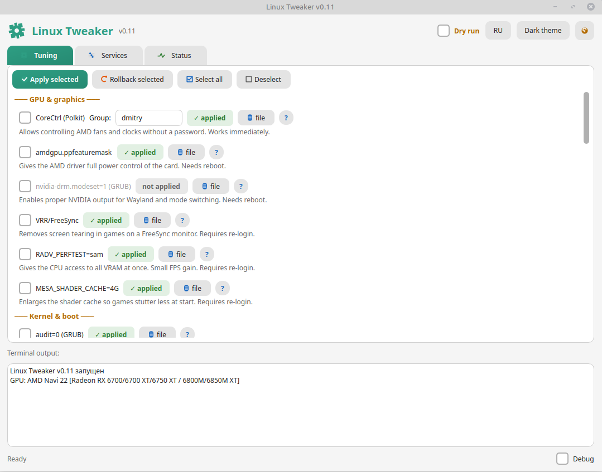
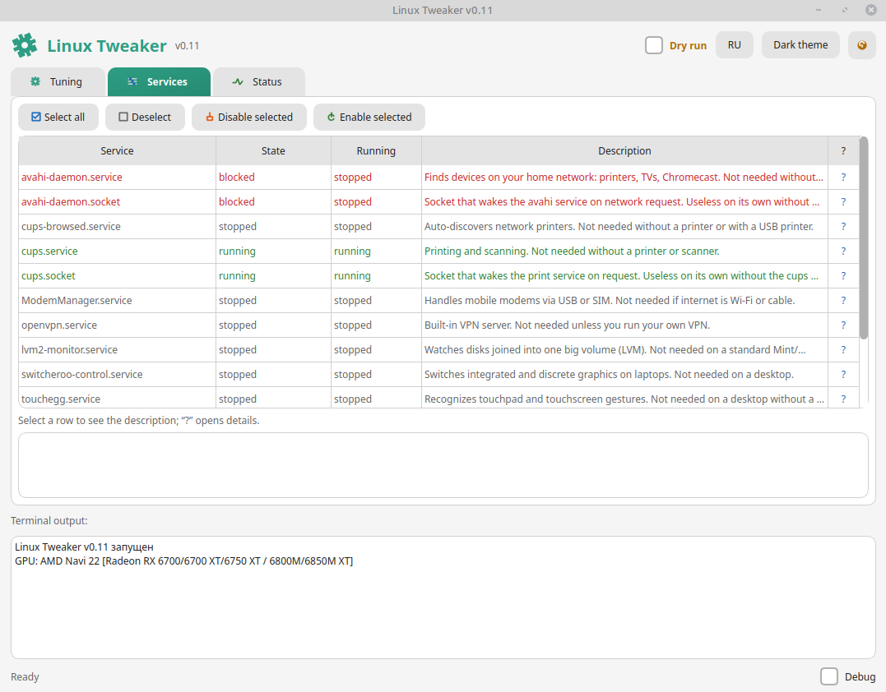

Linux Tweaker

A graphical tuning shell for Linux Mint (primary target) and other systemd-based distributions such as Ubuntu, Debian, Pop!_OS, elementary OS, Zorin OS and similar.

Distributed as a single AppImage — no installation, no dependencies, no root required to launch.

Written in Python 3 with PyQt6.
What it is

Linux Tweaker is a small desktop application that bundles the most common performance, logging, disk and gaming tweaks for a home Linux PC into one window. Instead of editing /etc/fstab, GRUB_CMDLINE_LINUX_DEFAULT, sysctl.d, modprobe.d and systemd units by hand, you tick the checkboxes you want and press Apply.

Every change is reversible. Before modifying any file, the app saves a copy in ~/system-tuneup-backups/. If something goes wrong, Rollback restores the previous state.

The interface is available in Russian and English and adapts to your system: options that don't apply to your hardware are greyed out automatically.
Installation
Recommended: AppImage

    Download the latest LinuxTweaker-x86_64.AppImage from the Releases page.

    Make it executable:
    bash

    chmod +x LinuxTweaker-x86_64.AppImage

    Run it:
    bash

    ./LinuxTweaker-x86_64.AppImage

No installation is required. The AppImage contains Python, PyQt6 and every dependency it needs. It runs on any modern x86_64 Linux with a working graphical session.
Optional: run from source

If you prefer to run it as a plain Python script:
bash

sudo apt install python3-pyqt6
python3 linux_tweaker.py

Only PyQt6 is required. Everything else is part of the Python standard library.
Usage

Launch the AppImage by double-clicking it or from a terminal. You will see three tabs:
Tuning

The main tab. Every tweak is grouped by category:

    GPU & graphics

    Kernel & boot

    System logs

    Sound

    Network

    Memory & swap

    Drives & filesystems

    Gaming & compatibility

    Convenience

    Updates

Each option has:

    a checkbox — tick it to include the tweak in the next apply;

    a short description of what it does;

    a green ✓ applied or grey not applied badge — the app checks your system and shows whether the setting is already active, even if you configured it manually;

    a file button — opens the file the tweak will modify, so you can see the current contents;

    a ? button — opens a detailed explanation written for newcomers.

Options that don't apply to your machine (for example, VRR on a non-AMD GPU, ntfs3 with no NTFS disks, zram without the zram-generator package) are disabled automatically.

When you're ready, press Apply selected. The app will ask for your sudo password once, then apply each tweak and log the result in the terminal panel at the bottom.
Services

A table of system services that are usually unneeded on a home PC: Avahi, CUPS, ModemManager, OpenVPN, LVM monitor, Switcheroo, Touchegg, ZFS ZED, kerneloops and others. Select the rows you don't need and press Disable selected. Each row has a ? column that opens a detailed description.

This is useful if you want to reduce background activity on your system without touching systemctl by hand.
Status

A full summary of your system in one place:

    OS and architecture

    CPU model

    GPU and driver

    Screen resolution and refresh rate

    RAM (with type and speed if dmidecode is available)

    Swap type and size

    Kernel version

    Desktop environment

    RAID / ntsync availability

    User and home folder

    All system partitions with filesystem and free space

    Every tweak from the Tuning tab with its current state

    Every service from the Services tab with its current state

    Kernel parameters (vm.swappiness, vfs_cache_pressure, numa_balancing, tcp_congestion_control, THP mode)

    Auto-update timer state

Use the Refresh button to re-scan.
Dry run

Enable the Dry run checkbox in the top bar before pressing Apply or Rollback. In this mode, the app only prints the commands it would run — no files are changed, no services are touched. Handy for learning what each tweak actually does.
Backups and rollback

Before modifying any file, Linux Tweaker saves a copy in:
text

~/system-tuneup-backups/

The backup name is the full path with slashes replaced by underscores, plus .bak. For example, /etc/default/grub becomes etc_default_grub.bak.

To roll back a tweak:

    Tick its checkbox in the Tuning tab.

    Press Rollback selected.

The app will remove the changes it made and, where applicable, restore files from the backups.

Some tweaks (GRUB parameters, ntfs3, zram) require a reboot or re-login to fully take effect — this is mentioned in each option's help popup.
Available tweaks (short list)
Category	Tweak
GPU	CoreCtrl Polkit rule, amdgpu.ppfeaturemask, nvidia-drm.modeset=1
GPU	VRR/FreeSync, RADV_PERFTEST=sam, MESA_SHADER_CACHE=4G
Kernel	audit=0, raid=noautodetect, nmi_watchdog=0
Kernel	vfs_cache_pressure=50, numa_balancing=0, Magic SysRq (REISUB)
Logs	Disable rsyslog, move journald to RAM (50 MB cap)
Sound	PipeWire buffer tuning
Network	TCP BBR + fq
Memory	vm.swappiness tuning, zram-swap, zswap, Transparent HugePages
Disks	ntfs3 driver, commit=NN in fstab, noatime mount option
Gaming	ntsync kernel module, Steam compatdata symlinks
Convenience	Shell commands in .bashrc
Updates	systemd auto-update timer for APT and Flatpak

Each one has a detailed help popup in the app.
Requirements

    Linux Mint 20+ (primary target, Ubuntu 20.04 base) — tested and recommended.

    Ubuntu 20.04+, Debian 11+, Pop!_OS, elementary OS, Zorin OS, and other systemd-based distributions — supported, with minor differences in some tweaks.

    x86_64 architecture.

    A running X11 or Wayland session. The app is a GUI tool and will not work over a plain SSH connection without X forwarding.

    sudo access. Not required to launch, but required to apply or roll back tweaks.

    The AppImage does not require Python or PyQt6 installed on the host. Everything is bundled.

What is Linux Mint–specific?

Most tweaks are generic and work on any modern systemd distribution. A few are tailored to Linux Mint:

    ntfs3 driver unlock. Linux Mint ships a file (/usr/lib/modprobe.d/mint-blacklist-ntfs3.conf) that blocks the fast in-kernel NTFS driver. The tweak lifts that block. On Ubuntu and Debian the file usually doesn't exist, so the option is greyed out automatically.

    Auto-updates. Linux Mint has its own built-in auto-update (mintupdate). The tweak warns you to disable it, otherwise updates run twice.

    Cinnamon extras. If Cinnamon is detected, .bashrc commands and the auto-update timer include cinnamon-spice-updater for updating applets and themes.

Everything else — GRUB parameters, sysctl, fstab options, systemd services, PipeWire, BBR, zram, ntsync — works the same on all distributions.
Safety notes

    The app modifies system files. It backs them up first, but always keep your own backups of important data.

    Read the help popup (?) before enabling a tweak. Especially for raid=noautodetect (do not enable if you use RAID), commit=NN (risk of losing recent writes on power loss), and ntfs3 (make a backup first).

    commit=NN and zram require a reboot. VRR, RADV_PERFTEST, MESA_SHADER_CACHE require a re-login.

    The app can be run as root, but this is not recommended. When run as a normal user, it asks for sudo only when needed and targets your home folder for user-specific files (.bashrc, PipeWire config, Steam symlinks). When run as root, user-specific tweaks target /root instead — which is usually not what you want.

Debug log

Enable the Debug checkbox in the bottom bar to write a detailed log to:
text

~/linux-tweaker-debug.log

The log includes every command, every file read and write, every service check, and any Python crash with a full traceback. faulthandler is enabled at the same time, so native crashes are captured too.

If you find a bug, please include this log in your report.
Screenshots

Building the AppImage yourself

If you want to build the AppImage from source:

    Install python3-pyqt6 and pyinstaller:
    bash

    sudo apt install python3-pyqt6 python3-pip
    pip3 install pyinstaller

    Build the executable:
    bash

    pyinstaller --onefile --windowed --name LinuxTweaker linux_tweaker.py

    Convert to AppImage using appimagetool:
    bash

    ./appimagetool-x86_64.AppImage AppDir LinuxTweaker-x86_64.AppImage

Contributing

Bug reports and pull requests are welcome. When reporting a bug, please include:

    Your distribution and version (e.g., Linux Mint 21.3 Cinnamon).

    The debug log from ~/linux-tweaker-debug.log.

    What you were trying to do and what happened instead.

License

MIT 

Dmitry Svistunov — GitHub

Project repository: Linux-Tweaker
Disclaimer

This tool modifies system files and settings. It is designed to be safe and reversible, and it backs up every file it touches. However, you use it at your own risk. If you're unsure about a tweak, read its help popup first, or use Dry run to see what it would do without applying anything.
</parameter>
